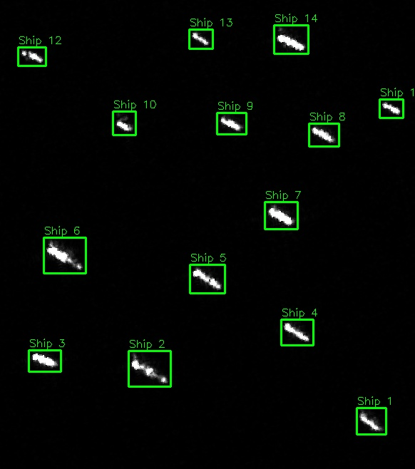

# AI usage disclaimer
Qwen3.7-Plus was used to implement **everything except** the logic for `basic_classical_cv.py` and `simple_cnn.py` (ie cli functionality was generated by the LLM). The description of the purpose of the files were used as prompts to generate the files.

# Motivation
Synthetic Aperture Radar (SAR) images are especially useful in maritime intelligence. While ships are usually tracked via their AIS pings, their transponders may be switched off to disable the pings, essentially making them disappear. However, since ships are usually giant metal targets, they are highly reflective to the wavelengths the SAR images are taken at, and appear as a bright white spot against the non-metallic sea.

However, there may be a huge amount of imagery to manually search through. To automate this process, computer vision can be used.

# Project

This is just a small project to use classical computer vision to get a rough count of ships in a SAR image.

Features
- Counts number of ships detected in a SAR image
- Outputs an image with bounding boxes drawn for detected ships
- Able to use a DEM grayscale image to automatically mask out landmasses (Note: You will miss out ships that are docked)



# How-To/Usage
```
usage: basic_classical_cv.py [-h] [--dem DEM] [--output OUTPUT] image_path

Detect ships in SAR images

positional arguments:
  image_path       Path to the SAR image file

options:
  -h, --help       show this help message and exit
  --dem DEM        Path to the DEM (Digital Elevation Model) file (optional)
  --output OUTPUT  Output file path (default: detected_ships.jpg)
```

eg, `python .\basic_classical_cv.py .\tester3.png --dem .\tester3_dem.png`, where
- `tester3.png` is your SAR image
- `tester3_dem.png` is your DEM image

# Extra
You can use `copernicus_get_image.py` to download images from the [Copernicus Data Space Ecosystem](https://dataspace.copernicus.eu/). However, you have to create an account and put your login details into a `.env` file with the following.

```
COP_USERNAME = "<username>"
COP_PASSWORD = "<password>"
```


Currently, you have to use their [Requests Builder](https://shapps.dataspace.copernicus.eu/requests-builder/) to generate the data required to download, and edit it into the file.
