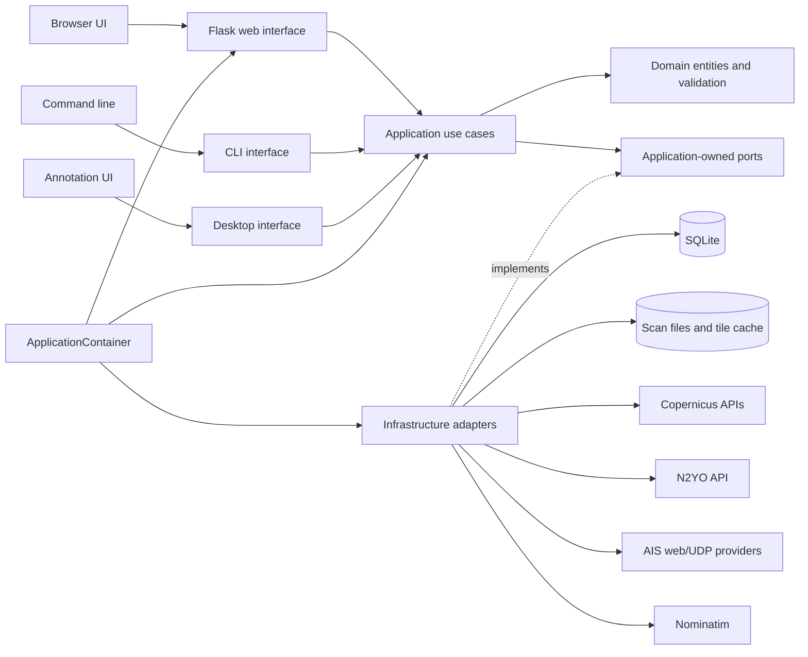
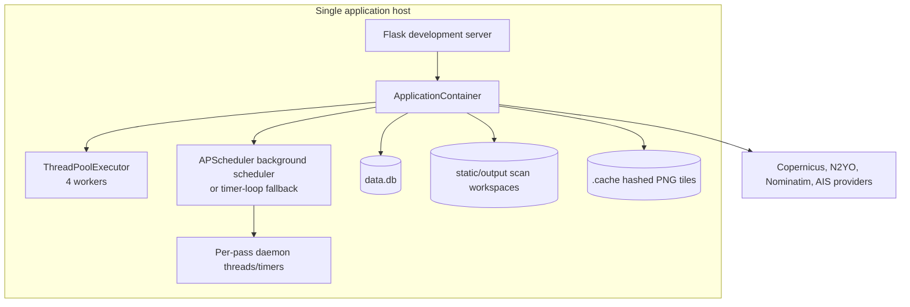
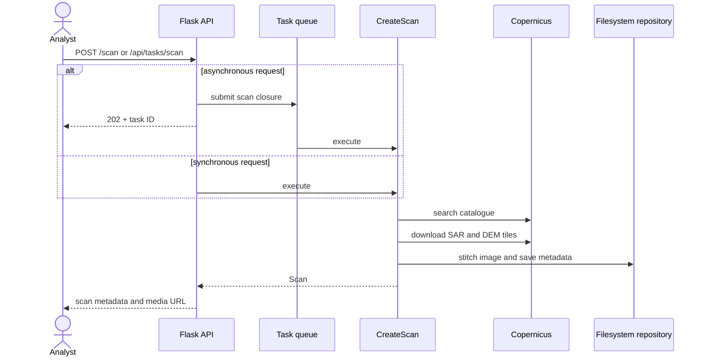

# Sentinel Imagery Analysis — System Architecture Report

**Assessment date:** 9 September 2026  
**Scope:** Current repository and working-tree implementation  
**System type:** Single-host Python web/CLI application for Sentinel-1 SAR acquisition, vessel-candidate detection, satellite-pass scheduling, and AIS correlation

## Executive summary

Sentinel Imagery Analysis is a modular maritime-intelligence application that acquires Sentinel-1 synthetic-aperture radar (SAR) imagery, detects candidate vessels using classical computer vision, predicts future satellite passes, and gathers Automatic Identification System (AIS) positions for comparison. It provides a server-rendered Flask web interface, JSON APIs, command-line workflows, and an interactive desktop annotation tool.

The codebase follows Clean Architecture with meaningful separation between domain entities, application use cases and ports, infrastructure adapters, delivery interfaces, and the bootstrap composition root. Automated architecture tests enforce the inward dependency rule, and inspection found no direct imports from the application or domain layers into Flask, SQLite, OpenCV, or other outer-layer implementations. This is the system's strongest architectural quality: external providers and persistence mechanisms can be substituted without rewriting core orchestration.

Operationally, however, the system is a modular monolith rather than a distributed or horizontally scalable service. Flask, the APScheduler worker, pass-monitor threads, an in-memory task queue, SQLite, the filesystem scan repository, and external-service clients all run on one host and usually in one process. That topology is appropriate for a local analyst workstation, prototype, or small single-user deployment. It is not yet safe for multiple web workers or an internet-facing multi-user deployment because scheduled jobs would be duplicated, task state would not be shared, SQLite write contention would grow, filesystem state would require shared storage, and the APIs have no authentication or authorization.

The end-to-end mission design is coherent: an analyst defines an area of interest (AOI); the system combines N2YO orbital predictions with historical Copernicus acquisition cycles; scheduled monitors collect AIS near a flypast; post-pass jobs poll the Copernicus catalogue; matching imagery is downloaded and tiled, stitched, optionally masked with elevation data, and processed by a deterministic OpenCV detector. The result is useful candidate-vessel intelligence, but it should not be treated as confirmed classification or identity correlation. The detector confidence is a brightness-derived heuristic rather than a calibrated probability, and no explicit SAR-to-AIS association engine is present.

The most important near-term work is operational hardening, not decomposition into microservices. The recommended sequence is to establish an explicit deployment profile and trust boundary, centralize startup/migrations and structured logging, make background work durable and single-owner, correct the post-pass timeout ownership regression, pin dependencies, and add production serving/health guidance. Only after demand exceeds the single-host profile should background processing and persistence be extracted.

### Overall assessment

| Quality attribute | Assessment | Rationale |
|---|---|---|
| Modularity | Strong | Ports, protocols, use cases, and adapters are clearly separated; dependency direction is tested. |
| Functional cohesion | Strong | Workflows map cleanly to mission concepts: scans, AOIs, passes, AIS, detection, and post-pass ingestion. |
| Maintainability | Moderate–strong | Good boundaries and broad tests, offset by several large modules, compatibility branches, duplicated fallback logic, and stale documentation. |
| Reliability | Moderate | Atomic file writes, transactions, retries, cooldowns, and shutdown coordination exist; task state and scheduler leadership are not durable. |
| Security | Suitable only for trusted local use | Input/path validation and response headers exist, but there is no authentication, authorization, CSRF protection, or encrypted secret store. |
| Scalability | Limited | Single-process threads, SQLite, local files, and in-memory tasks constrain multi-user and multi-instance operation. |
| Observability | Limited–moderate | Scraper execution logs and scheduler status exist, but there is no unified structured telemetry, health model, or persistent job history. |
| Testability | Strong design; current snapshot not green | The repository contains 261 tests and CI across Python 3.11/3.12; the current local run includes environment-related failures and one reproducible timeout regression. |

## Detailed analysis

### 1. System purpose and boundaries

The system covers six related capabilities:

1. Define and manage geographic AOIs as validated bounding boxes.
2. Search Copernicus Data Space for Sentinel-1 acquisitions, download SAR/DEM tiles, stitch them, and retain scan metadata.
3. Detect bright connected regions in SAR imagery and calculate axis-aligned and oriented vessel measurements.
4. Predict satellite passes by combining N2YO orbital tracking with historical Sentinel-1 acquisition patterns.
5. Ingest and retain vessel identity and position data from pluggable AIS sources.
6. Automate AIS monitoring around a pass and SAR ingestion after a pass.

The system does not currently provide calibrated vessel classification, confirmed SAR-to-AIS identity matching, multi-tenant access control, distributed processing, or a production operations plane.

### 2. Architectural style

The implementation is a Clean Architecture modular monolith.

The package roles are:

| Layer | Location | Responsibility |
|---|---|---|
| Domain | `sentinel_analysis/domain` | Immutable entities, coordinate/time normalization, validation errors, satellite definitions. |
| Application | `sentinel_analysis/application` | Use cases, provider/repository protocols, result types, application errors, cooperative shutdown state. |
| Infrastructure | `sentinel_analysis/infrastructure` | SQLite/filesystem repositories, Copernicus/N2YO/geocoder clients, AIS plugins, image processing, scheduling, and task execution. |
| Interfaces | `sentinel_analysis/interfaces` | Flask routes and serialization, CLI commands, desktop annotation UI. |
| Bootstrap | `sentinel_analysis/bootstrap` | Environment configuration and dependency composition. |

Dependency inversion is real rather than cosmetic. Application use cases depend on structural `Protocol` ports such as `ImageryProvider`, `ScanRepository`, `AISRepository`, `PassPredictor`, `TaskQueue`, and `SettingsRepository`. `ApplicationContainer` is the composition root that selects concrete adapters.

### 3. Runtime topology

The default web deployment is one Python process launched through `app.py`:

Important runtime consequences:

- `create_app()` starts the scheduler as a side effect. Every process that constructs the app therefore becomes a scheduler owner.
- Asynchronous web scan tasks are stored only in `ThreadedTaskQueue._tasks`; they disappear on restart and are invisible to other processes. A `background_tasks` table exists in migration 003 but is not used by the active queue adapter.
- APScheduler jobs use `max_instances=1` within a process, but there is no cross-process leader election or distributed lock.
- SQLite uses short-lived connections, foreign keys, a five-second busy timeout, and transactions. WAL mode is not enabled.
- Scan imagery and metadata live in per-scan filesystem directories, while relational mission state lives in SQLite. There is no transaction spanning these stores.

This is a sound local-first topology. It should be documented and protected as such until durable job infrastructure and a production database/storage strategy are introduced.

### 4. Component analysis

#### 4.1 Domain model

The central immutable entities include `BoundingBox`, `Acquisition`, `ImageTile`, `Scan`, `AreaOfInterest`, `ShipDetection`, `BackgroundTask`, `Vessel`, `VesselPosition`, `AISRecord`, and `PostPassIngestionJob`.

Notable strengths:

- Geographic coordinates are finite, range-checked, and ordered.
- Timestamps are normalized to UTC at the domain boundary.
- Vessel navigation values, task progress, detection dimensions, and post-pass state values are validated.
- Frozen dataclasses reduce accidental mutation across threads and layers.
- `BoundingBox.split_into_zones()` supports providers with viewport or response-size limits.

Limitations:

- The post-pass state machine is represented as validated strings rather than a dedicated enum/state-transition model.
- Detection confidence is stored in the same shape as a probabilistic score, although its implementation is heuristic.
- There is no first-class entity for association between a SAR detection and an AIS vessel track.

#### 4.2 Application services

Use cases are generally small orchestration units. Representative flows include `CreateScan`, `DetectShips`, `IngestAIS`, `PredictAreaOfInterest`, `CheckAndScheduleAOIs`, `IngestPostPassImagery`, and scraper/settings management.

The design supports isolated testing with fake adapters. However, a growing amount of compatibility code uses `hasattr()` and catches `TypeError` to accommodate adapters with older signatures. That preserves backwards compatibility but weakens the otherwise explicit port contracts. Port evolution should be made deliberate through versioned interfaces or coordinated adapter updates.

Several broad exception catches intentionally preserve partial mission progress, such as allowing DEM or vessel detection to fail without invalidating a downloaded SAR scan. This is a reasonable policy, but failures are sometimes suppressed without a durable warning record. Mission results should explicitly capture partial-success states.

#### 4.3 Web and CLI interfaces

The Flask application registers blueprints for scans, AOIs, AIS, schedules/post-pass jobs, scrapers/logs, background tasks, and settings. Server-rendered templates are enhanced by substantial browser-side JavaScript for maps, layers, inspection, notifications, scheduling, and AIS timelines.

Positive controls include:

- Strict bounding-box/domain validation.
- JSON object and integer parsing helpers.
- Scan-folder validation in both the web boundary and repository.
- Stable translation of expected errors to HTTP 400, 404, and 502 responses.
- Generic 500 responses for unexpected exceptions.
- A one-megabyte Flask request limit.
- `nosniff`, `SAMEORIGIN`, and referrer-policy headers; JSON responses are marked `no-store`.
- Escaping helpers for dynamically generated browser markup, covered by tests.

The CLI exposes `detect`, `download`, `predict`, `ingest`, and `annotate` commands and maps expected application errors to stable process exit codes. The web and CLI both construct or consume the same application use cases, which is a good example of interface independence.

#### 4.4 External-service adapters

The principal external dependencies are:

| Dependency | Use | Resilience behavior |
|---|---|---|
| Copernicus identity endpoint | OAuth access token | Token cache, safety-adjusted expiry, forced refresh after authorization failure. |
| Copernicus STAC Catalogue | Latest/historical acquisition search | Request validation, timeouts, transient retry behavior. |
| Sentinel Hub Process API | SAR and DEM tile retrieval | Long download timeout, token refresh, transient retries, filesystem cache. |
| N2YO | Radio-pass prediction | 30-second timeout and response-shape translation. |
| Copernicus catalogue history | Mission repeat-cycle analysis | Converted into historical and extrapolated pass evidence. |
| Nominatim | Reverse geocoding | Best-effort label resolution; scan creation can retain a fallback. |
| AIS Friends | Community AIS data | Plugin isolation, multi-zone collection, configurable pacing. |
| VesselFinder / APRS.fi | Browser-assisted web AIS collection | Playwright sessions, stealth support, cooldown after blocking/rate limits. |
| UDP NMEA input | Local AIS receiver | Daemon listener and buffered decoding via `pyais`. |

AIS plugins are isolated at execution time: failure in one provider is logged and does not stop the next provider. Automated ingestion honors enabled/disabled state and escalating cooldowns. The default registry also enables mock data providers, which is convenient for demos but can mix synthetic and live data if an operator does not understand the defaults.

#### 4.5 Image-processing pipeline

The scan pipeline performs the following sequence:

1. Search for an acquisition in a default or requested time window.
2. Calculate a geographic tile grid.
3. Download SAR tiles, using hashed filesystem cache entries where possible.
4. Stitch the complete tile grid to a temporary output and atomically replace the final image.
5. Best-effort download and stitch DEM tiles.
6. Reverse-geocode the AOI centre and write `metadata.json` atomically.
7. Delete intermediate workspace tiles.

The detector loads SAR imagery in grayscale, optionally applies a DEM-derived land/coastal mask, optionally denoises using Lee or Frost filtering, thresholds bright pixels, dilates fragmented returns, extracts contours, rejects contours outside configured area bounds, and calculates oriented bounding boxes. Length and beam are derived using configured pixel spacing; heading comes from the OpenCV minimum-area rectangle.

The implementation is deterministic and interpretable, but the reported confidence is calculated from mean contour intensity relative to the threshold. It is not empirically calibrated. False positives from sea state, structures, sidelobes, and coastal clutter remain expected even with DEM masking.

### 5. Principal workflows

#### 5.1 Manual or asynchronous scan

The scan workspace is rolled back if preparation succeeds but a later mandatory step fails. DEM failure is explicitly non-fatal. The asynchronous path has no progress callbacks despite the task model supporting progress.

#### 5.2 Pass prediction and scheduling

For each auto-capture AOI, the hybrid predictor retrieves N2YO and historical mission predictions in parallel, filters to enabled satellites, merges matching events within a 15-minute window, and assigns source/confidence metadata. Historical extrapolation receives more weight than N2YO tracking. N2YO-only predictions can support AIS monitoring but are intentionally excluded from automatic post-pass SAR ingestion because they do not prove an imaging acquisition.

The scheduler performs frequent AOI checks (default 30 seconds) and separate post-pass catalogue scans (default one hour). A pass monitor uses timers and daemon threads to collect AIS roughly once per minute within a ±5-minute flypast window. Eligible historical or cross-validated passes create persistent post-pass ingestion jobs.

#### 5.3 Post-pass SAR ingestion

Persistent jobs move through `PENDING_PASS`, `POLLING_CATALOG`, `INGESTING`, and terminal `COMPLETED`, `TIMED_OUT`, or `FAILED` states. Catalogue polling uses progressive delays of 2, 3, 5, then 10 minutes at the use-case level, although the enclosing scheduler normally checks due work hourly by default. Matching imagery must fall within ±1 hour of the expected acquisition. A newer acquisition beyond that window is treated as evidence the expected pass was missed.

A responsibility overlap currently exists: `SQLitePostPassIngestionRepository.get_jobs_due_for_poll()` automatically changes jobs older than 24 hours to `TIMED_OUT` before returning due jobs, while `IngestPostPassImagery.execute()` also contains timeout transition and result-generation logic. The repository can therefore hide an expired job from the use case. This is the cause of the reproducible failing timeout test (`expected one TIMED_OUT result, received none`). Timeout ownership should be placed in one layer.

#### 5.4 AIS ingestion

AIS ingestion selects one or all registered plugins, injects stored plugin configuration, skips disabled or cooling-down plugins for automated runs, authenticates and fetches records, normalizes them into domain entities, persists vessel and position data, and updates execution logs. Failures are isolated per plugin. Cooldown duration rises from 15 minutes to one hour and then four hours after repeated network, rate-limit, or anti-bot failures.

### 6. Data architecture

#### 6.1 SQLite

Versioned SQL migrations create the following persistent concerns:

- AOIs and auto-capture state.
- Vessels and timestamped vessel positions.
- Scraper execution logs, configuration, cooldown, tags, and trigger reasons.
- Background-task schema (currently unused by the runtime queue).
- Cached AOI prediction/mission-analysis payloads with expiry.
- Post-pass ingestion jobs and expected imagery times.
- General system settings stored as JSON values.

Repositories open short-lived connections and use parameterized SQL. Transactions commit or roll back at the connection boundary, and foreign-key enforcement is enabled on every connection. The schema has useful indexes for vessel history, forecasts, and due post-pass work.

Concerns:

- Migrations run independently from the constructors of four repositories, causing repeated startup checks and making schema ownership diffuse.
- Migration filenames have two separate `005_...` entries; ordering is deterministic by full filename but the numeric prefix is not a unique version.
- The existing `ARCHITECTURE.md` lists obsolete Python migration names and does not reflect the active SQL migration set.
- No retention or archival policy limits vessel positions, scraper logs, forecast history, cached tiles, or scan imagery.
- N2YO's API key can be stored as JSON text in SQLite. It is masked in settings responses but not encrypted at rest.

#### 6.2 Filesystem

Each scan is a directory containing an `images` subdirectory and `metadata.json`. The repository validates scan names and ensures image paths remain within the intended workspace. Metadata and cache entries use temporary files followed by atomic replacement. Scan deletion recursively removes the validated scan directory.

Because imagery and SQLite state are separate stores, a crash can leave an orphaned scan or a job referring to missing files. A reconciliation command or startup audit would improve recoverability.

### 7. Security and trust model

The current implementation should be treated as a trusted-local application bound to the Flask default loopback interface.

Existing safeguards include input type/range checks, filename/path containment, parameterized SQL, secret masking in the settings API, keeping Copernicus credentials out of SQLite, generic unexpected-error responses, output-size limits, and basic browser hardening headers.

Material gaps for any shared or network-exposed deployment:

1. No authentication or authorization protects read, configuration, ingestion, scan, or deletion APIs.
2. No CSRF protection exists for state-changing browser requests.
3. There is no explicit Content Security Policy or HTTPS termination configuration.
4. N2YO credentials stored through the settings UI are plaintext at rest in SQLite.
5. Operational endpoints can trigger expensive external calls and compute without per-user rate limits or quotas.
6. Scraping adapters interact with third-party sites through browser-stealth mechanisms; legal, contractual, and source-availability risks should be reviewed separately from software security.
7. Synthetic AIS providers are enabled by default and should be visually and operationally isolated from production evidence.

If the application remains strictly local, document that boundary and avoid binding to a non-loopback address. If it becomes shared, add an authenticated reverse proxy or application identity layer before exposing it.

### 8. Reliability, concurrency, and performance

Strengths include atomic scan metadata/image output, transactional SQLite writes, Copernicus retry/token-refresh behavior, per-plugin AIS failure isolation, scraper cooldown, APScheduler job coalescing, `max_instances=1`, cooperative shutdown checks, and explicit cleanup of scheduler, task pool, pass monitors, and UDP listeners.

Key risks:

- Multiple application processes create duplicate schedulers and pass monitors.
- In-memory tasks are lost on process restart and cannot be resumed.
- Thread workers can perform long external HTTP downloads of up to 300 seconds per request; shutdown cancels queued futures but cannot forcibly stop running calls.
- SQLite's default journal mode and five-second busy timeout may surface lock errors under simultaneous ingestion, scheduling, and web writes.
- The Frost filter uses nested Python loops over every pixel and will scale poorly on large stitched scenes.
- Full images are read into memory for OpenCV analysis and crop extraction; there is no explicit upper bound on stored image dimensions.
- The pass scheduler's hourly due-job scan can dominate the use case's intended 2–10-minute progressive polling unless operators lower the interval.
- Error suppression in fallback paths can turn actionable dependency failures into absent or stale data without a unified alert.
- The shutdown watchdog uses `os._exit(0)` after its deadline, which guarantees termination but can bypass flush/finalizers and reports a success exit code.

### 9. Configuration and deployment

Environment configuration defines project, database, output, cache, Copernicus credentials, N2YO key, debug flag, and port. Feature settings are then seeded into SQLite and can be edited through the web UI. Some settings are live-read by adapters, and scheduler intervals are explicitly rescheduled after updates.

There are two configuration planes with partial overlap. Runtime-critical settings such as port, filesystem roots, debug mode, and the scheduler's initially injected API key are fixed when the process starts, even though similarly named values appear in the settings database. The UI can therefore imply that a change is active when a restart or explicit runtime wiring is required. Settings should be classified as either bootstrap-only or live-reloadable and presented accordingly.

The repository runs Flask's built-in development server and has no Dockerfile, production WSGI configuration, service definition, or deployment manifest. Dependencies in `requirements.txt` are mostly unpinned. CI installs current dependency versions and runs `unittest` on Ubuntu with Python 3.11 and 3.12, which gives useful portability coverage but reduces build reproducibility.

### 10. Maintainability and test posture

The repository currently contains approximately:

- 112 application Python files / 11,295 lines.
- 25 Python test files / 5,872 lines.
- 17 JavaScript files / 6,675 lines.
- 10 HTML templates / 2,509 lines.
- 261 discovered test functions/methods.

Architecture tests explicitly check dependency direction and the absence of removed legacy imports. Tests also cover domain invariants, provider contracts, retries, migrations, caching, image processing, web input/error contracts, task execution, scheduler behavior, pass monitoring, post-pass ingestion, settings, and scraper management.

The current local full-suite run is not green. Many errors are attributable to permission failures under the configured test temporary directory in this managed Windows environment. Independently, the isolated post-pass timeout test fails reproducibly because expired jobs are transitioned and filtered in the repository before the use case can report them. The working tree also contains pre-existing uncommitted changes, so this assessment describes the current snapshot rather than asserting the main branch has the same result.

Large modules worth splitting by responsibility include `sqlite_ais.py`, `copernicus.py`, `manage_scrapers.py`, `sqlite_settings.py`, `ingest_post_pass_imagery.py`, and the scheduler/monitor modules. Splitting should preserve the current ports and be driven by cohesive responsibilities rather than line count alone.

### 11. Key architectural findings

| Priority | Finding | Impact | Recommendation |
|---|---|---|---|
| Critical before network exposure | APIs have no identity, authorization, or CSRF control. | Any network client could read data, alter configuration, trigger costly jobs, or delete scans. | Keep loopback-only now; add authentication, role checks, CSRF protection, TLS termination, and request throttling before shared use. |
| High | Every app process starts its own scheduler. | Duplicate AIS collection, external requests, and post-pass jobs under multi-worker deployment. | Separate scheduler startup from app construction and enforce a single scheduler leader/process. |
| High | Background task state is in memory while an unused task table exists. | Tasks and status disappear on restart and do not work across processes. | Implement a durable queue adapter or remove the misleading table until durability is supported. |
| High | Post-pass timeout transitions have two owners. | Expired jobs can disappear from use-case results; a focused test currently fails. | Move timeout state transition and result construction entirely into the use case or return transitioned jobs from the repository. |
| High | Production deployment is unspecified and dependencies are unpinned. | Non-reproducible builds and unsafe use of the development server. | Add a lock/constraints strategy, supported Python matrix, production server instructions, health checks, and backup/restore procedures. |
| Medium | Bootstrap and live settings overlap without consistent activation semantics. | Operators may believe persisted changes are active when components still use startup values. | Classify settings as bootstrap-only/live and provide explicit reload/restart status. |
| Medium | SQLite and filesystem form a non-transactional aggregate. | Crashes can create orphaned state or broken job-to-scan references. | Add idempotency keys, reconciliation, and periodic integrity checks. |
| Medium | Detection score looks probabilistic but is heuristic. | Analysts may over-trust candidate confidence and dimensions. | Rename/label the score, calibrate against a labelled validation set, and report uncertainty. |
| Medium | Broad exception suppression reduces diagnosability. | Partial failure can appear as missing data rather than a clear degraded state. | Emit structured warnings and persist mission partial-success/failure reasons. |
| Medium | No data lifecycle policy exists. | SQLite, scan imagery, and cache use can grow indefinitely. | Add configurable retention, archive/export, and cache eviction policies. |
| Low | Existing architecture documentation is stale. | Onboarding and operations decisions may use incorrect workflows/schema information. | Replace or link it to this report and generate migration/component inventories from code where practical. |

### 12. Recommended target evolution

#### Phase 1 — Stabilize the local modular monolith

- Fix the post-pass timeout ownership regression and restore a green, repeatable suite.
- Move migration execution to one explicit bootstrap step and adopt unique migration versions.
- Separate scheduler start/stop from Flask app construction.
- Add structured logs with correlation identifiers for scans, AOIs, jobs, and scraper runs.
- Pin dependencies through a lock or constraints file and document supported Python versions.
- Mark synthetic AIS data throughout storage and UI, or disable mock providers outside demo mode.
- Define backup, restore, retention, and scan/database reconciliation procedures.
- Clarify which settings require restart and which are applied live.

#### Phase 2 — Harden for a shared single-host service

- Put the app behind a production WSGI server and authenticated TLS reverse proxy.
- Add authorization roles, CSRF protection, request rate limits, and audit events.
- Run exactly one dedicated scheduler/worker process.
- Persist task state and implement idempotent job claims with leases.
- Enable and validate SQLite WAL/backup behavior, or move relational state to PostgreSQL if write concurrency demands it.
- Add readiness/liveness checks and metrics for queue depth, external latency, job age, SQLite locks, and ingestion outcomes.

#### Phase 3 — Scale only if workload requires it

- Extract long-running scan and AIS work into durable workers backed by a broker.
- Store large imagery in managed/shared object storage while retaining metadata in the relational database.
- Introduce distributed job locks, idempotency keys, retry/dead-letter policy, and trace propagation.
- Consider a dedicated SAR/AIS association service only after a validated correlation model and throughput requirement exist.

The current port/use-case boundaries already provide useful seams for this evolution. A broad microservice rewrite is not required to achieve the first two phases.

### 13. Final assessment

Sentinel Imagery Analysis has a good internal architecture for a local-first analytical tool. Its clean boundaries, rich domain validation, adapter isolation, atomic filesystem operations, and extensive automated tests create a credible base for further development. The main architectural mismatch is between that mature internal modularity and an operational model that is still prototype-grade: one unprotected Flask process owns threads, scheduling, local state, and external orchestration.

The best next step is to preserve the modular monolith while making its operating assumptions explicit and reliable. Once the scheduler has a single owner, jobs are durable, security boundaries are added, builds are reproducible, and state can be reconciled and observed, the system will be substantially more dependable without the complexity cost of premature service decomposition.
