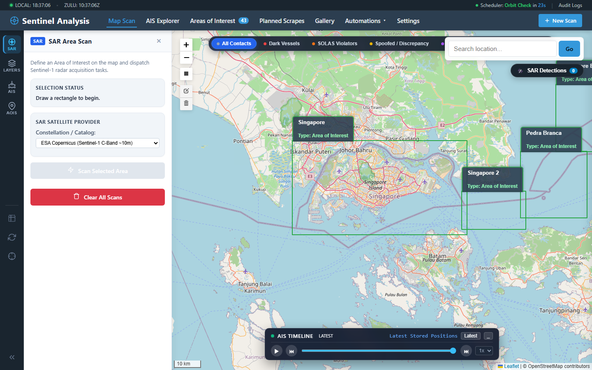
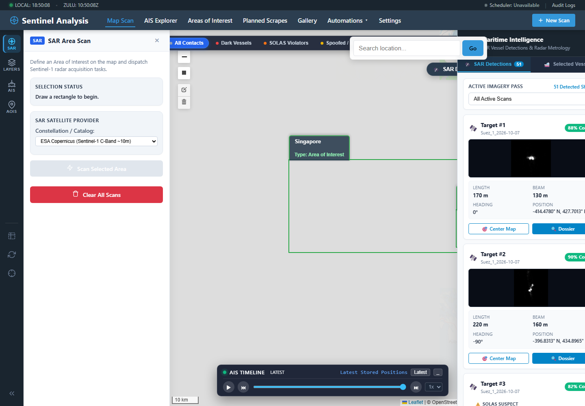
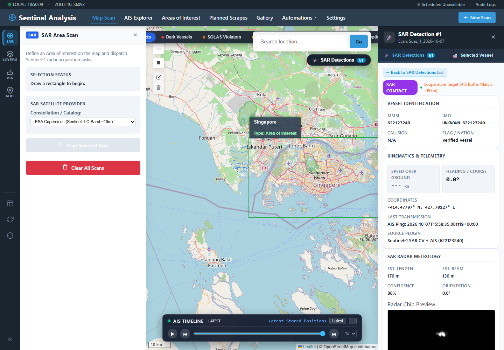

# Tactical C2 Web Interface & Operations Guide

The Sentinel Imagery Analysis Command and Control (C2) web application provides maritime watchstanders, intelligence analysts, and coast guard operators with an interactive operational canvas for monitoring maritime traffic, identifying non-cooperative dark vessels, and reviewing automated intelligence feeds.



*The main operator view keeps acquisition controls, geospatial context, contact filtering, and temporal playback visible together.*

---

## 🗺️ 1. Tactical Map Canvas

The primary operating picture is built upon an interactive Leaflet mapping engine optimized for high-density spatial data:

```
+------------------------------------------------------------------------------------+
| [Sentinel-1 SAR C2 Operating Picture]                                [Gallery] [AOI]|
|                                                                                    |
| [All (42)] [🚨 Dark (14)] [⚠️ SOLAS (8)] [🟣 Spoofed (2)] [🟡 STS (4)] [🛰️ S2 (18)]  |
|                                                                                    |
|  +----------------------------------------------------+ +------------------------+ |
|  | ~ ~ ~ ~ ~ ~ ~ ~ ~ ~ ~ ~ ~ ~ ~ ~ ~ ~ ~ ~ ~ ~ ~ ~ ~  | | CONTACT DOSSIER DRAWER | |
|  | ~ ~ ~ ~ ~ ~ ~ [SAR Swath Footprint] ~ ~ ~ ~ ~ ~ ~  | | Target: SAR-DET-004    | |
|  | ~ ~ ~ ~ ~ ⚓ (AIS Tanker) ~ ~ ~ ~ ~ ~ ~ ~ ~ ~ ~ ~  | | Length: 224m (Panamax) | |
|  | ~ ~ ~ ~ ~ ~ ~ ~ ~ ~ ~ 🔴 (Dark Vessel 185m) ~ ~ ~  | | Speed: 14.2 kn (Wake)  | |
|  | ~ ~ ~ ~ ~ 🟡─🟡 (STS Rendezvous Pair) ~ ~ ~ ~ ~ ~  | | Status: NON-COOPERATIVE| |
|  | ~ ~ ~ ~ ~ ~ ~ ~ ~ ~ ~ ~ ~ ~ ~ ~ ~ ~ ~ ~ ~ ~ ~ ~ ~  | | [KMZ] [CoT] [PDF Brief]| |
|  +----------------------------------------------------+ +------------------------+ |
+------------------------------------------------------------------------------------+
```

### Map Layer Controls
- **Satellite / Nautical Base Maps**: Toggle between high-resolution satellite imagery, standard topographic base maps, and OpenSeaMap nautical chart overlays with navigational marks and depth contours.
- **SAR Footprints**: Translucent overlays indicating the exact spatial extent of Sentinel-1 radar swaths.
- **Vessel Markers**:
  - 🟢 **Cooperative Vessel (Green)**: Radar contact successfully correlated with broadcast AIS telemetry.
  - 🔴 **Non-Cooperative Dark Vessel (Red)**: Confirmed radar detection with no correlated AIS transponder broadcast within the kinematic gate.
  - 🟡 **STS Rendezvous Pair (Amber)**: Two vessels loitering within $500\text{ m}$ proximity under low drift velocities.
  - 🟣 **AIS Spoofing Suspect (Purple)**: Transponder broadcast speed or heading contradicts hydrodynamic radar wake physics.

---

## 🔍 2. Tactical Quick-Filter Bar

Positioned directly above the tactical map, the Quick-Filter Bar allows watchstanders to isolate high-priority targets with a single click. When a filter is selected, matched contacts are spotlighted with an enhanced halo while non-matching contacts are dimmed:

| Filter Pill | Tactical Purpose | Operational Criteria |
|---|---|---|
| **All Contacts** | Full maritime picture | Shows all correlated and uncorrelated radar detections. |
| **🚨 Dark Vessels** | Non-reporting interdiction | Detections lacking correlated AIS within kinematic drift bounds. |
| **⚠️ SOLAS Suspect** | Regulatory non-compliance | Uncorrelated targets with physical length $> 50\text{ m}$ ($> 300\text{ GT}$ threshold). |
| **🟣 AIS Spoofed** | Deceptive behavior | Velocity discrepancy $> 3\text{ kn}$ or heading divergence $> 45^\circ$ vs. wake physics. |
| **🟡 STS Risk** | Dark fleet transshipment | Paired vessels within $500\text{ m}$ loitering at matched speeds $< 2\text{ kn}$. |
| **🛰️ Optical Match** | Multi-sensor validation | Targets cross-validated against cloud-free Sentinel-2 optical imagery passes. |

---

## 📋 3. Interactive Contact Telemetry Dossier Drawer

Clicking any radar detection on the map or in the detection sidebar slides open the **Contact Telemetry Dossier Drawer**, exposing granular intelligence:



*The detection sidebar provides a rapid triage list for all contacts in the active imagery pass.*



*Selecting a contact opens its full identification, correlation, kinematics, coordinates, source, metrology, and radar-chip record without leaving the map.*

### A. High-Resolution Radar Chip Inspector
- Displays a high-contrast zoomed radar chip crop of the vessel.
- Pixel intensity histogram and radar cross-section (RCS) backscatter metrics.
- Oriented Bounding Box (OBB) overlay showing physical length, beam, and estimated orientation.

### B. Standardized IMO Sizing & Classification
- Automated categorization based on physical hull dimensions:
  - **Super-Tanker / VLCC / ULCC** ($> 280\text{ m}$, Beam $> 45\text{ m}$)
  - **Large Container / Capesize Bulker** ($200\text{--}280\text{ m}$)
  - **Panamax / Medium Cargo / Tanker** ($130\text{--}200\text{ m}$)
  - **Handymax / Coastal Commercial** ($70\text{--}130\text{ m}$)
  - **Offshore Support / Large Fishing / Tug** ($30\text{--}70\text{ m}$)
  - **Small Craft / Pleasure Craft** ($< 30\text{ m}$)

### C. Compliance & Threat Intelligence Cards
- **SOLAS Compliance Assessment**: Evaluates vessel size against international carriage requirements.
- **EEZ / MPA Geofencing**: Displays whether the vessel is inside a sovereign Exclusive Economic Zone or restricted Marine Protected Area.
- **Nearest AIS Range Rings**: Pinpoints the closest broadcasting vessels and distances in nautical miles.

### D. Hydrodynamic Wake Telemetry
- **Radon Wake Velocity**: Estimated true speed-through-water in knots derived from radar wake spectrum.
- **Estimated Course**: Resolved heading angle eliminating $180^\circ$ Doppler ambiguity.
- **Spoofing Delta**: Computed variance between broadcast AIS Speed Over Ground (SOG) and radar wake velocity.

### E. Multi-Sensor Analytics Card
- **Sentinel-2 Visual Match**: Status of coincident optical passes and true-color RGB chip preview.
- **Repeat-Pass Temporal Change**: Coherence comparison indicating whether the vessel is newly arrived, anchored long-term, or in transit.

### F. Tactical Interoperability Export Actions
- **Google Earth KMZ**: Downloads a `.kmz` bundle centered on this contact and scan.
- **MIL-STD-2525 CoT**: Generates a Cursor-on-Target XML event string for ATAK/WinTAK integration.
- **PDF Dossier Briefing**: Automatically renders a standalone multi-page intelligence briefing for this scan.

---

## 🛰️ 4. Scan Gallery & Historical Operations

Access the gallery via the top navigation bar or `http://127.0.0.1:5050/gallery`.

Each completed scan card provides:
- **Spatial Metadata**: Geographic bounding box, acquisition timestamp, satellite orbit (Ascending/Descending), and polarization mode.
- **Detection Summary**: Total detections, dark vessel count, and cooperative vessel count.
- **Route Corridor Visualizer Link**: Direct button to view high-resolution nautical chart corridor plots.
- **Export Quick Actions**: One-click download for PDF Briefing, Google Earth KMZ, and Cursor-on-Target XML feeds.


---

## 🎯 Next Steps

- Delve into the intelligence algorithms in the [**Maritime Intelligence Pipeline Guide**](maritime-intelligence.html).
- Explore radar physics and CV in the [**Sensor Processing & Physics Guide**](sensor-physics-cv.html).
