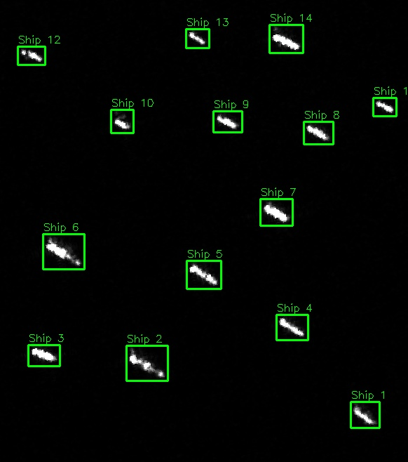
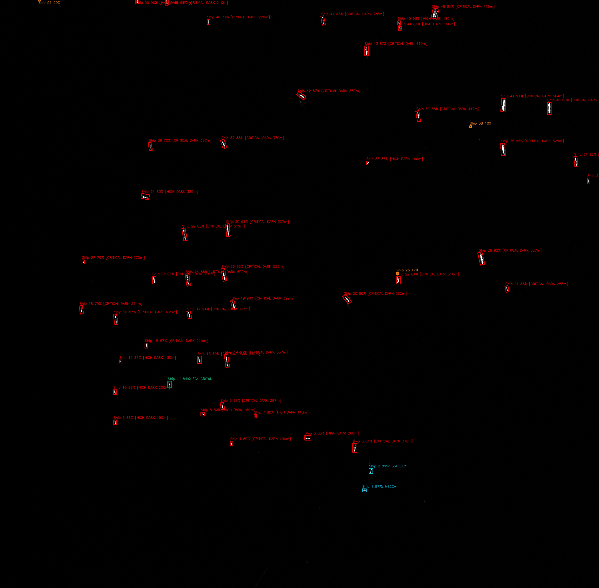

# Maritime Intelligence & Anomaly Detection Pipeline

The Sentinel Imagery Analysis platform bridges raw satellite observations with operational maritime intelligence. By correlating radar detections against terrestrial/satellite AIS feeds, maritime legal frameworks, and physical kinematics, it automatically flags illicit activities at sea.



*Detected radar contacts become the inputs for AIS correlation, compliance assessment, and anomaly classification.*



*The complete detection product labels 51 contacts and visually separates dark-vessel candidates from AIS-correlated shipping.*

---

## 🛰️ 1. AIS Telemetry Ingestion & Correlation

```
                    ┌───────────────────────────────┐
                    │  Sentinel-1 SAR Detection     │
                    │  (Lat, Lon, UTC Timestamp)    │
                    └───────────────┬───────────────┘
                                    │
                                    ▼
       ┌────────────────────────────────────────────────────────┐
       │ Kinematic Gating & Spatial Distance Calculation       │
       │ Maximum Gating Radius: R_gate = V_max * Δt + σ_pos     │
       └────────────────────────────┬───────────────────────────┘
                                    │
                 ┌──────────────────┴──────────────────┐
                 ▼                                     ▼
   ┌───────────────────────────┐         ┌───────────────────────────┐
   │ AIS Contact Correlated    │         │ Uncorrelated Detection    │
   │ Within Gating Ellipse     │         │ Outside Gating Bounds     │
   └─────────────┬─────────────┘         └─────────────┬─────────────┘
                 ▼                                     ▼
   ┌───────────────────────────┐         ┌───────────────────────────┐
   │ Cooperative Vessel Match  │         │ 🚨 Non-Cooperative Target │
   │ (MMSI, IMO, Vessel Name)  │         │   (Dark Vessel Alert)     │
   └───────────────────────────┘         └───────────────────────────┘
```

### Dynamic Multi-Provider AIS Ingestion
The platform supports pluggable AIS data sources:
- **Terrestrial AIS receivers**: Real-time NMEA AIVDM/AIVDO sentence stream parsing.
- **Satellite AIS aggregates**: Ingestion of global historical and live AIS tracks via commercial or open APIs.
- **SQLite Historical Spatiotemporal Store**: Indexes vessel positions by MMSI, coordinates, and UTC timestamps with R-Tree spatial indexing for sub-second query performance.

### Kinematic Gating & Spatial Correlation
When Sentinel-1 captures an image at timestamp $T_{\text{SAR}}$, AIS broadcasts at timestamps $T_{\text{AIS}}$ are projected to $T_{\text{SAR}}$ using a kinematic Kalman motion model:
$$\vec{p}(T_{\text{SAR}}) = \vec{p}(T_{\text{AIS}}) + \vec{v}_{\text{SOG}} \cdot (T_{\text{SAR}} - T_{\text{AIS}})$$

A radar contact is correlated with an AIS track if the distance $\Delta d \le R_{\text{gate}}$, where $R_{\text{gate}}$ accounts for time latency and maximum vessel maneuvering limits.


*The route-correlation product plots the monitored corridor, projected movement, intercept geometry, and correlated contact manifest.*

---

## 🚨 2. Dark Vessel Interdiction & SOLAS Compliance

Under **IMO SOLAS (Safety of Life at Sea) Convention Chapter V, Regulation 19**, all passenger ships regardless of size and all commercial cargo ships of $300\text{ gross tonnage (GT)}$ or more on international voyages are legally mandated to continuously broadcast AIS.

### Detection Heuristics
1. **Radar Hull Detection**: CFAR or deep learning isolates a reflective vessel structure in open water.
2. **Correlation Absence**: No active AIS transponder broadcast is located within the kinematic gating radius during the acquisition window.
3. **Physical Metrology Check**:
   - Estimated Hull Length $> 50\text{ m}$ (correlating to approximately $\ge 300\text{ GT}$).
   - **Classification**: **SOLAS Suspect Non-Cooperative Dark Vessel**.
4. **Threat Level Escalation**:
   - **High Threat**: Dark vessel loitering in vicinity of critical undersea infrastructure or sovereign borders.
   - **Medium Threat**: Dark vessel operating at transit speeds in international waters.
   - **Low Threat**: Small craft ($< 30\text{ m}$) exempt from mandatory SOLAS carriage.

The scan gallery surfaces these results beside the source imagery and keeps the resulting tactical products available to operators:


---

## 🤝 3. Ship-to-Ship (STS) Transshipment Detection

Dark fleet tankers often bypass economic sanctions and oil export caps by conducting clandestine cargo transfers at sea, turning off AIS transponders to mask loading locations.

```
                  Vessel A (Radar Target)
                        [=========>]
                             │
                     Distance < 500m
                 Relative Speed < 2.0 kn
                             │
                        [=========>]
                  Vessel B (Radar Target)
             STS Transshipment Alert Dispatched
```

### Algorithmic Verification
The `detect_transshipment.py` use case continuously analyzes pairwise vessel spatial geometry:
- **Proximity Gate**: Pairwise distance between vessel centroids $D \le 500\text{ m}$.
- **Velocity Matching**:
  - Absolute vessel speeds $V_A, V_B \le 3.0\text{ kn}$ (drifting or maneuvering at anchor).
  - Relative velocity $|V_A - V_B| \le 1.5\text{ kn}$.
- **Geographic Filtering**: Excludes recognized anchorage zones, ports, and commercial harbors to eliminate false alarms from congested docks.
- **Reporting Output**: Triggers an **STS Transshipment Warning** banner on both web UI and PDF briefings, linking both contact dossiers.

---

## 🛡️ 4. Sovereign EEZ & Marine Protected Area (MPA) Geofencing

The platform integrates standard international maritime boundaries (Exclusive Economic Zones) and restricted Marine Protected Areas (MPAs).

### IUU Fishing Interdiction
- **Spatial Containment**: Uses ray-casting point-in-polygon checks against national EEZ polygons.
- **Foreign Flag Interdiction**: If a foreign-flagged or dark vessel is detected within a nation's EEZ at loitering or trawling speeds ($1.5\text{--}4.5\text{ kn}$):
  - Automatically tagged with **IUU Fishing Suspect** advisory.
  - Alert recorded in the compliance log and dispatched to maritime authorities.
- **Restricted MPAs**: Any unpermitted vessel detected within ecologically protected marine reserves is immediately flagged for immediate interdiction.

---

## 🔔 5. Automated Webhook Alert Dispatching

When high-priority maritime anomalies are uncovered during post-acquisition scanning, the system dispatches structured notifications:

```json
{
  "event": "DARK_VESSEL_DETECTED",
  "threat_level": "CRITICAL",
  "scan_id": "S1A_IW_GRDH_20261009T051522",
  "target": {
    "target_id": "SAR-DET-004",
    "coordinates": {"lat": 1.2845, "lon": 103.8512},
    "classification": "Panamax Cargo / Tanker",
    "estimated_length_m": 182.4,
    "estimated_beam_m": 31.2,
    "solas_compliant": false,
    "wake_speed_knots": 13.8,
    "nearest_ais_nm": 6.4
  },
  "timestamp": "2026-10-09T05:15:22Z"
}
```

### Supported Webhook Adapters
- **Slack**: Sends rich interactive cards with target preview and quick download links.
- **Microsoft Teams**: Formatted adaptive cards with threat level color coding.
- **Discord**: Embedded message with coordinates, telemetry, and threat status.
- **Generic REST / C2 Endpoints**: Custom HTTP POST with raw JSON payload for ingestion into defense or maritime administration systems.

---

## 🎯 Next Steps

- Review the radar physics and computer vision algorithms in [**Sensor Processing & Physics Guide**](sensor-physics-cv.html).
- Learn how to export KMZ and Cursor-on-Target feeds in [**Reporting & Tactical Exports**](reporting-and-exports.html).
