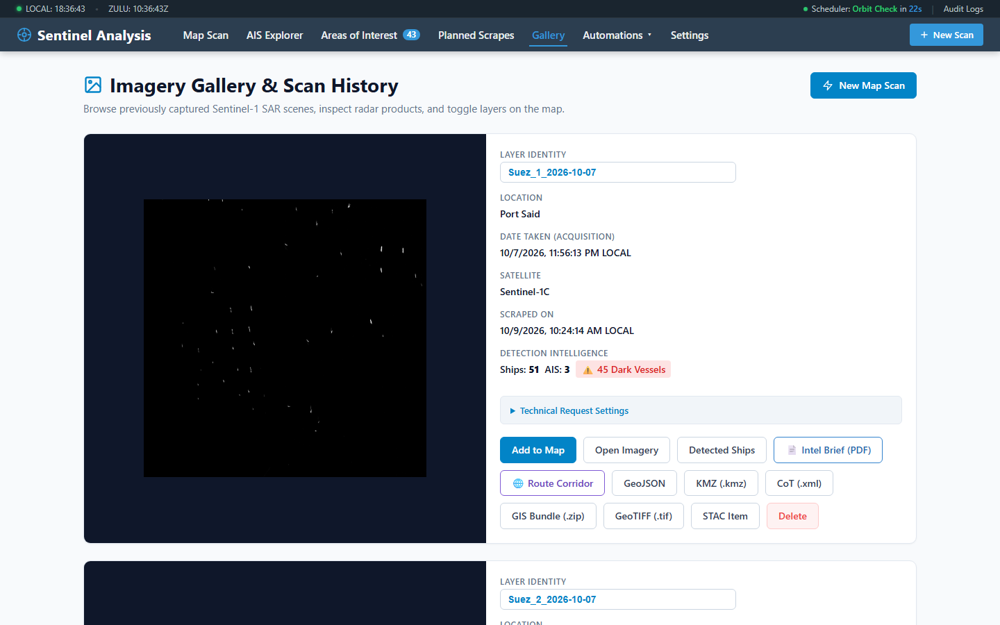
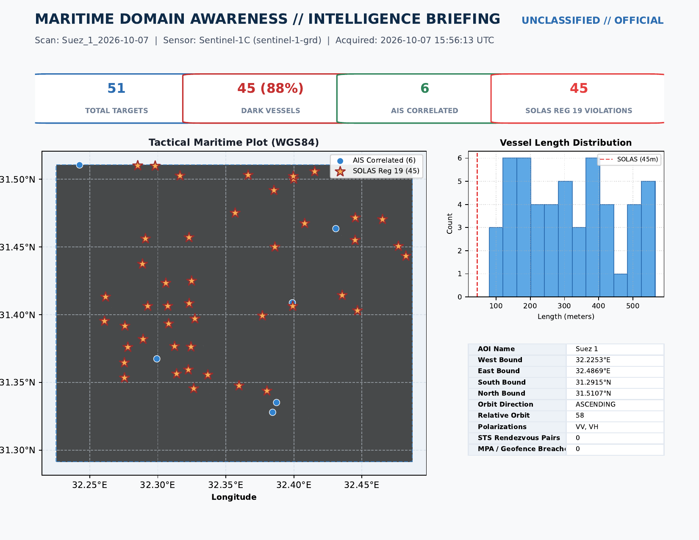
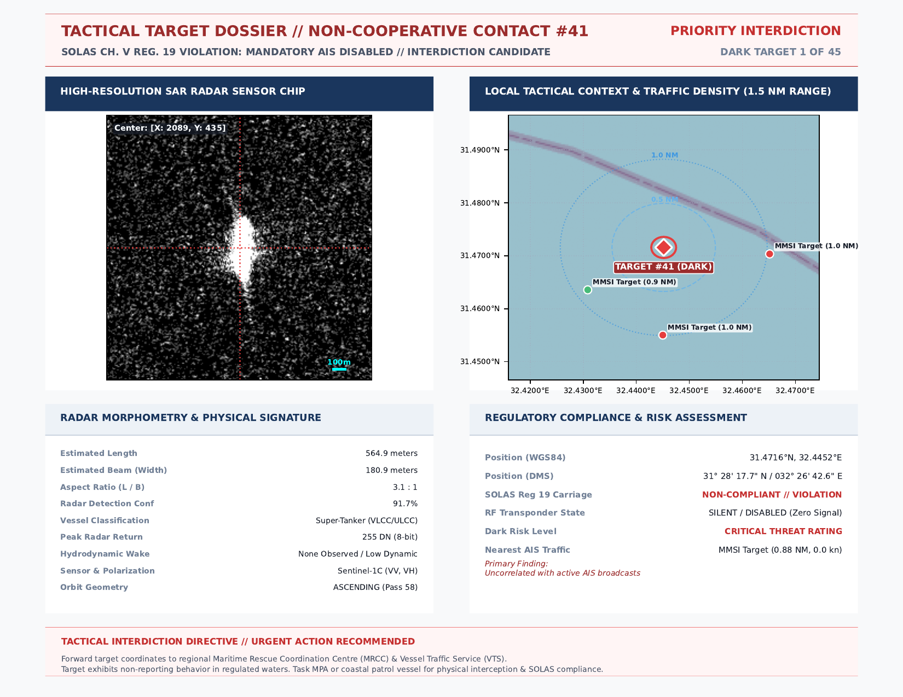
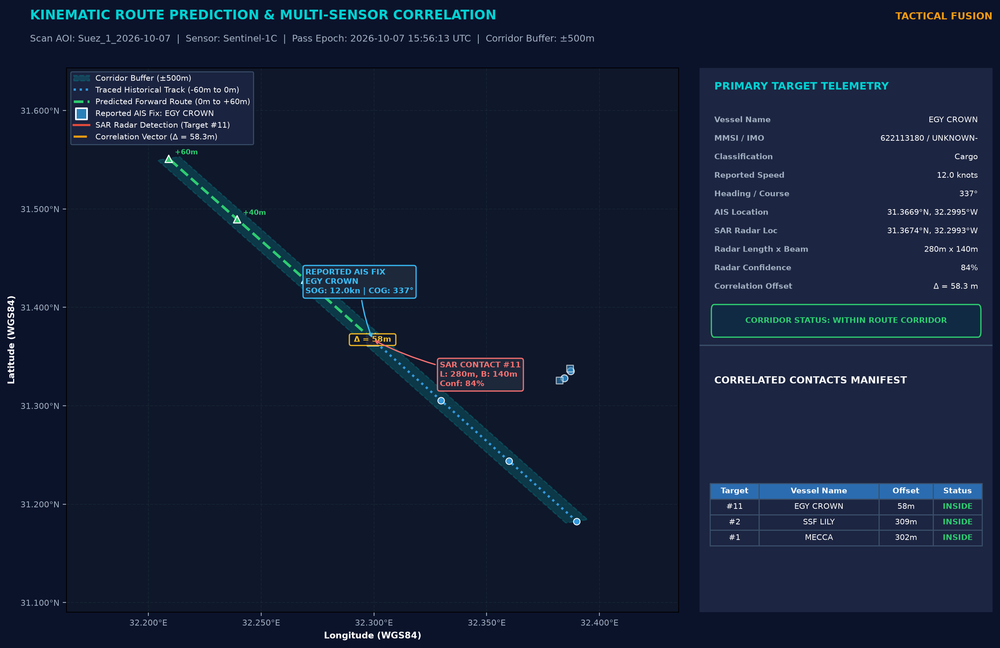

# Reporting, Nautical Overlays & Tactical Interoperability

The Sentinel Imagery Analysis platform transforms raw algorithmic detections into operational products tailored for maritime commanders, interdiction boarding teams, and external Command and Control (C2) situational awareness tools.



*Each analyzed scene exposes its intelligence summary and export actions from one operational card.*

---

## 📑 1. Executive Multi-Page PDF Intelligence Briefings

The automated briefing engine compiles a publication-grade PDF dossier for every analyzed satellite scan.



*The opening page consolidates acquisition metadata, detection totals, priority findings, confidence distribution, and the target manifest.*

```
+---------------------------------------------------------------------------------+
|  MARITIME DOMAIN INTELLIGENCE BRIEFING                                          |
|  Classification: UNCLASSIFIED // REL TO MARITIME AUTHORITIES                    |
|  Scan ID: S1A_IW_GRDH_20261009T051522       Date: 2026-10-09 05:15:22 UTC       |
|---------------------------------------------------------------------------------|
|  EXECUTIVE SUMMARY                                                              |
|  • Total SAR Detections: 42 vessels          • Cooperative (AIS): 28 vessels    |
|  • 🚨 Dark / Non-Reporting Targets: 14       • ⚠️ SOLAS Violations: 8 vessels   |
|  • 🟡 STS Transshipment Rendezvous: 2 pairs   • 🟣 AIS Spoofing Detected: 2     |
|---------------------------------------------------------------------------------|
|  NAUTICAL CHART SITUATIONAL OVERLAY                                             |
|  [High-Resolution OpenSeaMap Bathymetry & Navigational Marks with Target Vector]|
|---------------------------------------------------------------------------------|
|  STANDALONE KINEMATIC ROUTE CORRELATION CORRIDOR                                |
|  [AIS Trajectory Corridors + SAR Intercept Points + Kalman Projections]        |
|---------------------------------------------------------------------------------|
|  HIGH-PRIORITY TARGET DOSSIERS (One Dedicated Page Per Dark Vessel)             |
|  Target ID: SAR-DET-004 | SOLAS Status: NON-COMPLIANT | Length: 182m (Panamax)   |
|  [Radar Chip Crop]        [Nearest AIS Range Rings]      [Wake Telemetry]       |
+---------------------------------------------------------------------------------+
```

### PDF Dossier Sections

1. **Cover & Executive Summary**:
   - Area of Interest coordinates and acquisition timestamp.
   - Comprehensive threat metrics table (total vessels, dark vessels, SOLAS non-compliance rate).
   - High-level analyst briefing narrative.

2. **Nautical Chart Situational Overlay**:
   - Overlays all detected targets and historical tracks onto official **OpenSeaMap** nautical charts.
   - Highlights navigational hazards, shoals, depth sounding contours, and traffic separation schemes (TSS).

3. **Standalone Kinematic Route Correlation Corridor**:
   - Dedicated high-contrast chart isolating AIS vessel historical tracks and projected future corridors.
   - Displays time-stamped intercept points and cross-track error bounds.

4. **Individual Dark Vessel Dossier Pages**:
   - Every confirmed dark target receives a dedicated full-page dossier:
     - **High-Resolution SAR Radar Chip**: Contrast-enhanced crop of the target's radar signature.
     - **Nearest AIS Range Rings**: Visual map showing distances to nearby cooperative traffic.
     - **Metrology & Sizing**: Length, beam, and estimated IMO vessel category.
     - **Hydrodynamic Wake Telemetry**: Radon wake-derived velocity and heading.
     - **Compliance & Legal Assessment**: Mandatory SOLAS carriage violations and EEZ boundary status.



*A generated target page combines the source radar chip, local map, physical dimensions, correlation status, and risk assessment.*

5. **Cooperative Shipping Registry Table**:
   - Structured tabular index of all cooperative vessels (MMSI, IMO, Name, Flag, Speed, Destination).



*The route export provides a high-resolution operational view of the corridor, intercept geometry, and contact manifest.*

---

## 🌍 2. Google Earth KMZ Tactical Packages

The platform packages complete geospatial deliverables into standard `.kmz` archive files accessible via:
```text
GET /api/scan/<folder_name>/export/kmz
```

### KMZ Package Contents
- **Georeferenced SAR Quicklook Overlay**: Calibrated backscatter raster draped directly onto the 3D globe.
- **Vector Placemarks & Polygons**:
  - Red 3D placemarks for dark vessels with complete telemetry in the description balloon.
  - Green ship icons for cooperative AIS vessels.
  - Amber link vectors connecting STS transshipment rendezvous pairs.
- **Corridor Polylines**: Projected kinematic tracks showing historical movement.

---

## 🛰️ 3. MIL-STD-2525 Cursor-on-Target (CoT) XML Streaming

For operational military and homeland defense systems, the platform provides real-time Cursor-on-Target (CoT) streaming compliant with **MIL-STD-2525** symbology:
```text
GET /api/scan/<folder_name>/export/cot
```

### Sample CoT Event XML Payload

```xml
<?xml version="1.0" encoding="UTF-8"?>
<event version="2.0"
       uid="SAR-DET-S1A_20261009T051522-004"
       type="a-h-G-E-V"
       how="m-r"
       time="2026-10-09T05:15:22.000Z"
       start="2026-10-09T05:15:22.000Z"
       stale="2026-10-09T07:15:22.000Z">
  <point lat="1.284500" lon="103.851200" hae="0.0" ce="15.0" le="10.0"/>
  <detail>
    <contact callsign="DARK-VESSEL-004"/>
    <track speed="7.1" course="042.5"/>
    <remarks>
      NON-COOPERATIVE TARGET (SOLAS NON-COMPLIANT)
      Estimated Length: 182.4m (Panamax Cargo / Tanker)
      Radar Wake Velocity: 13.8 kn
      Nearest AIS: 6.4 NM
    </remarks>
    <usericon iconsetpath="COT_MAPPING_2525C/Surface/Hostile"/>
  </detail>
</event>
```

### ATAK / WinTAK / FalconView Integration
- **Direct TAK Server Ingestion**: Route the `/api/scan/<folder>/export/cot` stream into TAK Server via TCP/SSL port 8087.
- **Instant Tactical Display**: Targets appear as hostile or unknown surface tracks (`a-h-G` / `a-u-G`) with full telemetry cards on tactical Android / Windows tablets in the field.

---

## 🎯 Next Steps

- Explore programmatic access in the [**CLI & REST API Reference Guide**](cli-and-api.html).
- Return to the [**User Guide Overview**](index.html).
